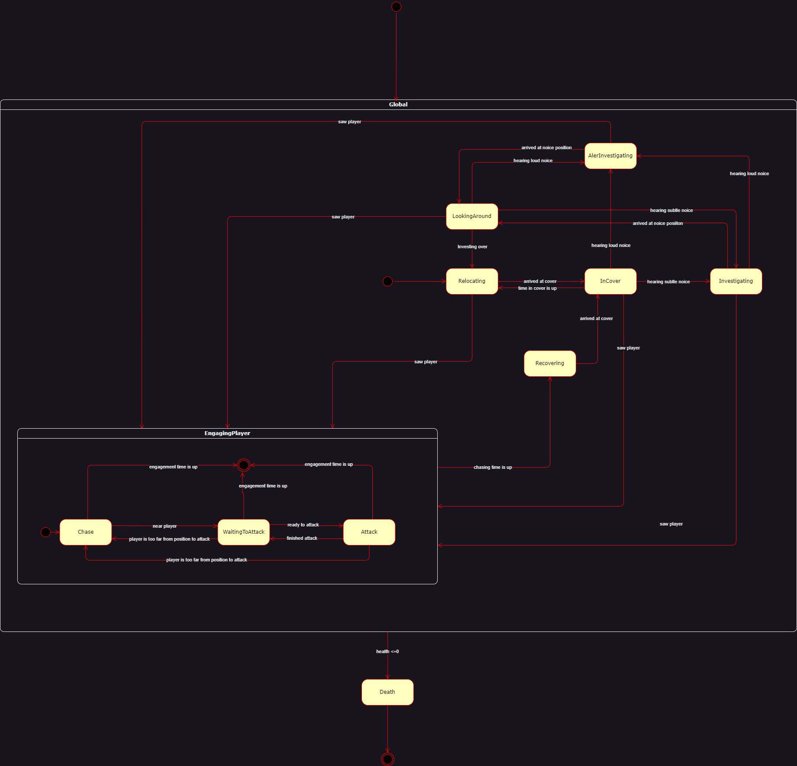
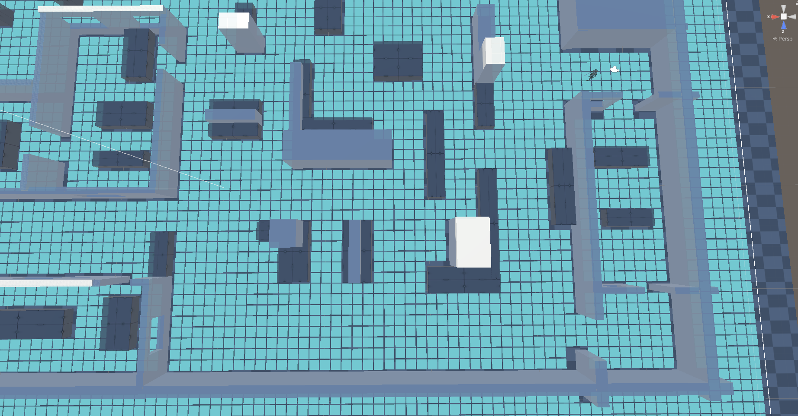
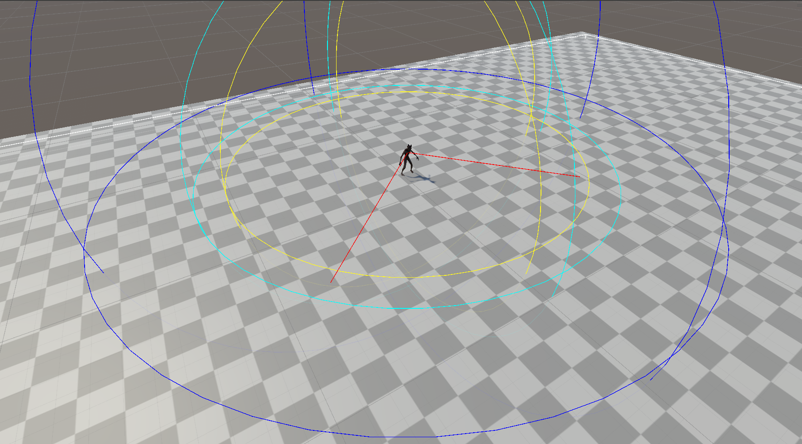
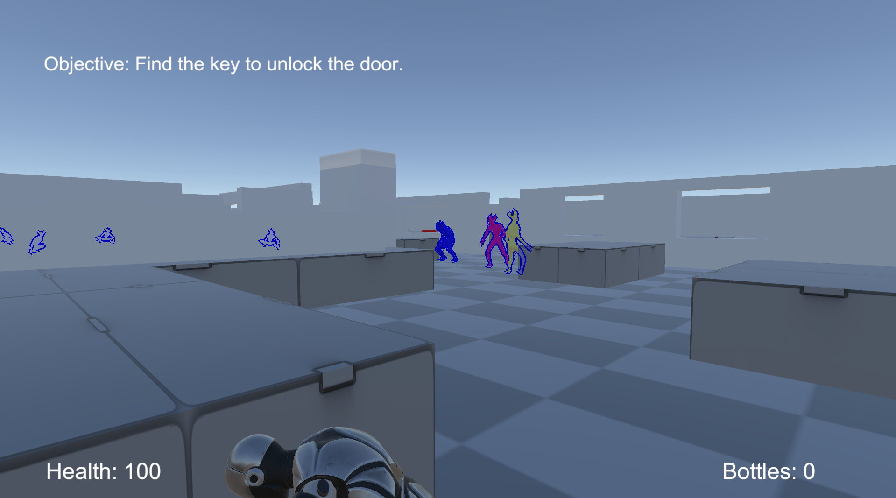
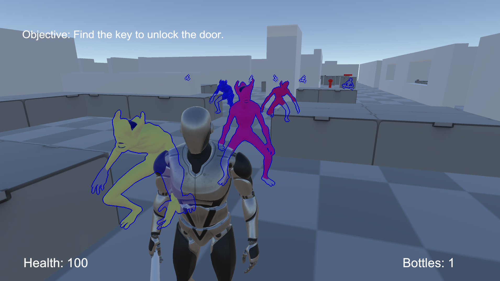
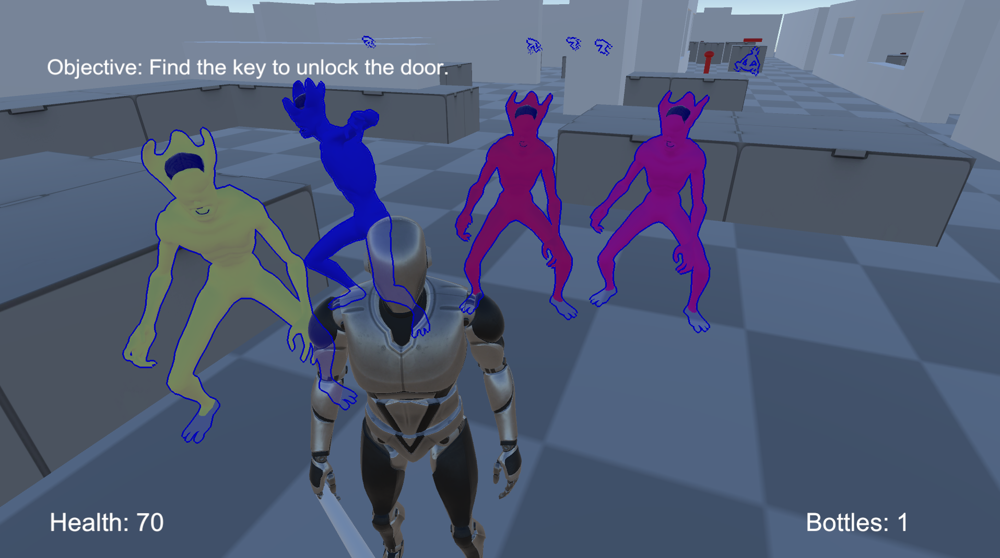

# Stalker AI (Unity)

A 3D Unity project that simulates the “Stalker” enemy behavior inspired by The Last of Us Part II. It implements an intelligent enemy that hides behind cover, reacts to sound, perceives the player via vision, coordinates with other agents, and uses a custom A* pathfinding grid to navigate the level.

## Table of Contents
- [Features](#features)
- [Inspiration](#inspiration)
  - [Video references](#video-references)
- [Behaviour](#behaviour)
  - [State diagram](#state-diagram)
  - [States overview](#states-overview)
  - [State transition table](#state-transition-table)
- [Project Structure (Selected)](#project-structure-selected)
- [Pathfinding](#pathfinding)
- [Perception](#perception)
- [Requirements](#requirements)
- [Setup](#setup)
- [Controls](#controls)
- [Screenshots](#screenshots)

## Features
- Finite State Machine (FSM) with 10 states (Relocating, InCover, Investigating, AlertInvestigating, LookingAround, Chase, WaitingToAttack, Attacking, Recovering, Death) plus a global state for always-on logic.
- Perception system:
  - Hearing: reacts differently to subtle (walking) vs. loud (sprinting, bottle break, combat) noises.
  - Vision: field of view and distance checks with obstacle masking and debug gizmos.
- Navigation: custom grid-based A* pathfinding (`Assets/Scripts/AI/*`).
- Cover system: agents move between configured `Cover` points, wait, and periodically relocate; refined InCover behavior and blending.
- Multi-agent system: agents coordinate via a `MessageBroker` so only one attacks at a time while others wait.
- Player mechanics: third‑person movement (Invector Lite), crouch, melee,  bottles throwing with trajectory prediction.
- Debug helpers: global and per-system debug consoles, vision/noise/cover gizmos, optional X‑Ray outlines toggle.

## Inspiration

Image from ["The Last Of Us Wiki - Stalker"](https://thelastofus.fandom.com/wiki/Stalker).  
I got inspired by the Stalker infected from The Last of Us Part II. When I played, they didn’t feel like simple bots that run straight at you. They hug the walls, peek from corners, react to bottles, and sometimes team up in a way that feels scary and smart. I wanted to recreate that same feeling: not perfect AI, but believable AI that keeps you on edge.

For this project I watched gameplay clips and wrote down everything the Stalkers actually do: hide in cover, listen for loud vs. subtle noises, search around the last place they heard you, chase for a while and then back off, and take turns attacking. I turned that list into clear states in a state machine and connected them with rules that make sense for a player. I also added throwables and “noise objects” because tricking enemies with sound is a big part of the tension in the original game.

I learned a lot about pathfinding (A* on a custom grid), clean code with finite state machines, and how much tiny details matter (like enabling hand colliders only during the attack animation). It’s not identical to the game, but it already gives me that “they are hunting me” vibe, which was my main goal.

### Video references:
["The Last Of Us Part 2 // AI Guide - Stalkers"](https://www.youtube.com/watch?v=Vv_DUFM5Nfw) by ["The Chief"](https://www.youtube.com/@TheChefGaming) 
["The Last of Us 2 | Ellie hunts the stalkers, Part 19.
"](https://www.youtube.com/watch?v=pzwFg-yHTV8) by ["JUST DR3I"](https://www.youtube.com/@JUSTDR3I) 
["All Stalker Fights (Grounded) - The Last of Us Series
"](https://www.youtube.com/watch?v=C5Z2guKp7OI) by ["BoBeast"](https://www.youtube.com/@BoBeast) 
["PUNCHES ONLY Vs Stalkers - No Damage (Grounded) - The Last of Us 2 (PS5)
"](https://www.youtube.com/watch?v=AbbzpqcYi0c) by ["Gweilo Ren
"](https://www.youtube.com/@GweiloRen)
## Behaviour
The Stalker uses Finite State Machine with a global state and sub‑states. Below is the state diagram, followed by a concise per‑state summary and the transition table.

### State diagram

### States overview
- Global: Always runs health checks and perception (vision/hearing) regardless of sub‑state.
- Relocating: Picks next `Cover` and moves to it. Can spot the player during this navigation.
- InCover: Waits in cover for `secondsInCover`.
- Investigating: Sneaks to a subtle‑noise position. On arrival, switches to LookingAround.
- AlertInvestigating: Runs to a loud‑noise position. On arrival, switches to LookingAround.
- LookingAround: Brief search around the last known position, then returns to Relocating.
- EngagingPlayer (container for interactions): active only while the agent is engaged with the player.
  - Chase: Pursues the player. If close enough, enters WaitingToAttack. A chase timer can force Recovering.
  - WaitingToAttack: Queues behind other stalkers via `MessageBroker`; when selected, transitions to Attack.
  - Attack: Plays attack animation and applies damage using hand colliders; returns to WaitingToAttack when done.
- Recovering: After a chase timeout, prioritizes reaching cover and ignores other stimuli until covered.
- Death: Triggered when health <= 0.

### State transition table

| Current State | Trigger | Next State |
| --- | --- | --- |
| Relocating, Recovering | Arrived at cover | InCover |
| InCover | Cover time elapsed | Relocating |
| Relocating, AlertInvestigating, Investigating, InCover, LookingAround | Player spotted | Chase |
| Chase | Close to player | WaitingToAttack |
| WaitingToAttack | Ready to attack | Attack |
| Attack | Attack finished | WaitingToAttack |
| Attack, WaitingToAttack | Player too far to attack | Chase |
| Attack, WaitingToAttack, Chase | Chase timer expired | Recovering |
| InCover, Investigating, LookingAround | Heard loud noise | AlertInvestigating |
| AlertInvestigating, Investigating | Arrived at noise position | LookingAround |
| InCover, LookingAround | Heard subtle noise | Investigating |
| LookingAround | Search finished | Relocating |
| Any | Health <= 0 | Death |

## Project Structure (Selected)
- `Assets/Scripts/AI/` – Grid, Node, Heap, PathSolver, AgentMovement, CollisionAvoidance
- `Assets/Scripts/StateMachine/` – generic `State<T>` and `StateMachine<T>`
- `Assets/Scripts/Stalker/` – `Stalker`, `StalkerStateMachine`, states under `States/`, messaging and noise listeners

## Pathfinding
The agent navigates using a custom A* implementation over a runtime grid.

- Grid generation (`Grid.cs`): constructs a walkability grid using `Physics.CheckSphere` against an `unwalkableMask`. If the sampled cell is unwalkable, a spiral search returns the nearest walkable node to avoid dead ends.
- Solver (`PathSolver.cs`): classic A* with a binary heap open set and hash‑set closed set. Recomputes when the target grid node changes.
- Movement (`AgentMovement.cs`): chooses straight‑line movement when there’s line‑of‑sight, otherwise follows node waypoints, smoothing rotation/position.

Grid overlay (gizmos):

## Perception
Two modalities drive transitions:

- Vision: configurable `viewAngle`/`viewDistance` with `obstacleMask` raycasts. Unobstructed targets in cone trigger engagement.
- Hearing: `NoiceListener` tracks last loud and subtle noise positions. Player walking emits subtle noise; sprinting, bottle breaks, combat, and NEO objects emit loud noise. Agents react within their ranges and move to the source (Investigating/AlertInvestigating).
- Gizmos: FOV and hearing radii are rendered for debugging.

Perception gizmos (FOV + hearing radii):

## Requirements
- Unity Editor: 2022.3.47f1 (LTS) (Recommended)
- Git recommended (one package is pulled from a Git URL)

Packages of note (auto‑resolved by Unity on open):
- Invector Third Person Controller Lite (included in project Assets)
- `com.cakeslice.outline-effect` (Git package)
- Animations and Animation Rigging (Mixamo)

## Setup
1. Install Unity Hub and add Unity `2022.3.47f1`.
2. Clone or download this repository.
3. Open the project folder in Unity Hub with the exact editor version above.
4. Let Unity import Assets and resolve packages.
5. Open a scene `Assets/Scenes/MultipleStalkersScene.unity`
6. Press Play in the Editor.

Optional build:
- Use `File > Build Settings…`, add the desired scene(s), set target platform, then Build.

Windows build:
- You can also download a build from Releases page: [GitHub Releases](https://github.com/petaaar88/stalker-ai/releases/tag/win-build).

## Controls
- Movement: `W/A/S/D`
- Sprint: `Left Shift`
- Crouch: `C`
- Interact / Pick up bottle: `E`
- Aim throw: `Right Mouse`
- Throw bottle: `Left Mouse` (while aiming)
- Melee attack: `Left Mouse` (not aiming)
- Toggle X‑Ray outlines: `H`

Notes:
- Walking generates subtle noise; sprinting generates loud noise. Crouching suppresses noise, making the player harder to detect by hearing.
- Thrown bottles and certain objects (NEO – Noise Emitting Objects) create loud noise on impact to lure stalkers.
- Only one stalker attacks at a time during an engagement; others queue and reposition.

## Screenshots

